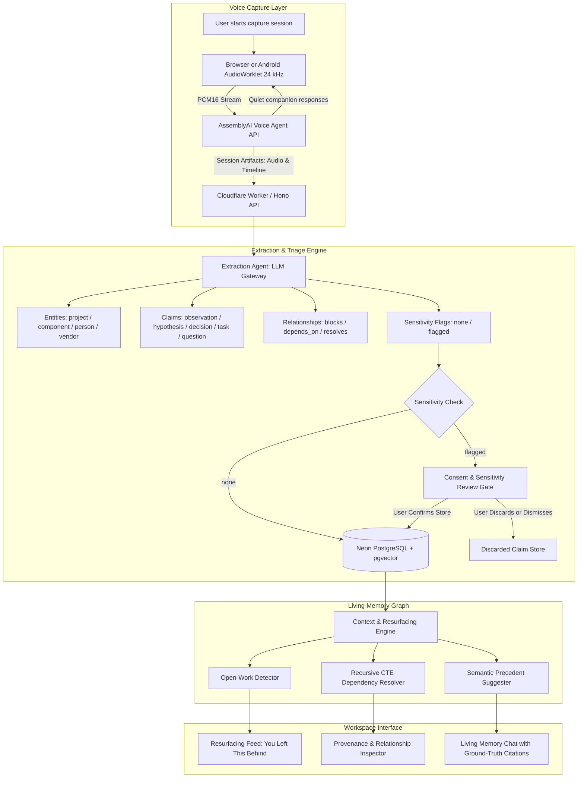
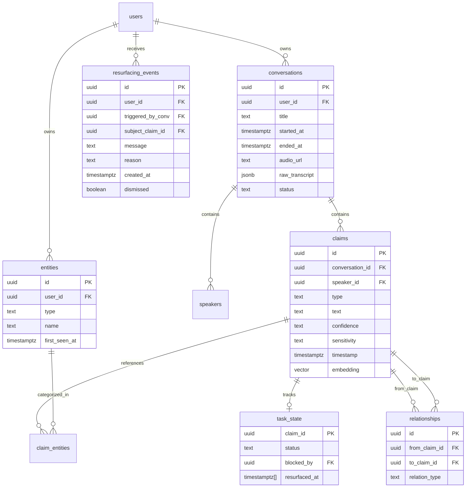
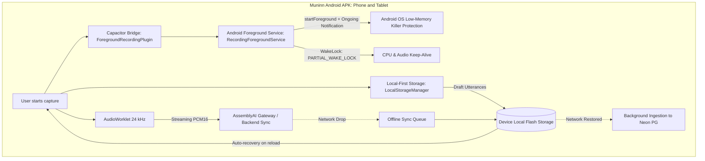

# Muninn

> **A living memory for your work**: captures conversations you choose, connects the decisions, problems, tasks, and people inside them, and tells you what is still unfinished and why.

[](LICENSE)
[](https://muninn-nmk.pages.dev)
[](https://muninn-api.kshitiz23kumar.workers.dev/api/health)
[](https://workers.cloudflare.com)
[](https://nextjs.org)
[](https://github.com/Erebuzzz/Muninn/releases)
[](https://www.assemblyai.com)

---

### About Muninn
Muninn is inspired by one of Odin's two sacred raven messengers from Norse mythology, whose name translates from Old Norse to *"memory"* or *"mind"*. It serves as an active cognitive companion that captures technical engineering discussions (via real-time 24kHz AudioWorklet stream or 1-tap quick voice memos), isolates verifiable ground-truth claims with turn-by-turn timestamps, weaves a recursive relational knowledge graph, and proactively resurfaces unfinished work, unblocked tasks, and conflicting decisions.

- **Live Production Website**: [https://muninn-nmk.pages.dev](https://muninn-nmk.pages.dev)
- **Cloudflare Edge API**: [https://muninn-api.kshitiz23kumar.workers.dev](https://muninn-api.kshitiz23kumar.workers.dev)
- **Web Application & Interactive Codex**: Ephemeral guest sandbox in session storage; persistent cloud retention upon optional sign-in.
- **Android Mobile & Tablet APK**: Local-first hardware persistence via Android SharedPreferences; zero mandatory cloud account.
- **Repository Topics**: `memory-system`, `audio-transcription`, `assemblyai`, `hono`, `nextjs15`, `cloudflare-workers`, `android`, `local-first`, `proactive-resurfacing`, `ai-companion`, `knowledge-graph`
- **Releases & APK Downloads**: [Muninn GitHub Releases](https://github.com/Erebuzzz/Muninn/releases)
- **Interactive Documentation**: Dedicated codex portal at [https://muninn-nmk.pages.dev/docs](https://muninn-nmk.pages.dev/docs)
- **Security Policy**: [SECURITY.md](SECURITY.md)
- **Privacy Policy**: [PRIVACY.md](PRIVACY.md)
- **License**: [MIT License](LICENSE)

---

## 1. System Philosophy

1. **Capture is opt-in, per session**: No ambient or always-on listening. The user initiates a Muninn session explicitly, like starting a voice memo.
2. **Triage happens inside the session**: Not everything said is equally durable, and some content is sensitive. Triage is a post-hoc filter on consented data:
   > *"You decide what gets heard. We decide what is worth remembering."*
3. **Core Loop**:
   ```
   TALK -> UNDERSTAND -> CONNECT -> REMEMBER -> NOTICE SOMETHING IMPORTANT -> TELL ME
   ```
4. **Verifiable Provenance**: Every stored claim retains its origin (source conversation, speaker, timestamp, and confidence status).
5. **Zero Cold-Start Edge Execution**: The primary backend runs on Cloudflare Workers with Hono and Neon Serverless PostgreSQL (`@neondatabase/serverless`), guaranteeing sub-millisecond response times without container spin-down or idle delays.

---

## 2. System Architecture



---

## 3. Data Model

The relational graph is persisted in Neon Serverless PostgreSQL with `pgvector` for semantic precedent matching and recursive common table expressions (CTEs) for multi-depth dependency chains.



---

## 4. The Agent Engine

Muninn divides responsibilities across four distinct services:

1. **The Voice Agent (AssemblyAI)**:
   - Quiet listening companion with one-sentence replies.
   - Dynamic keyterm biasing loaded from the user's `entities` table to prevent specialized component jargon from mishearing.
2. **The Extraction Agent (LLM Gateway)**:
   - Converts timestamped, speaker-tagged transcripts into structured JSON claims.
   - Classifies claim types (`observation`, `hypothesis`, `decision`, `task`, `question`) and direct non-hallucinated relationships.
3. **The Resurfacing Agent ("You Left This Behind")**:
   - Compares entities in the active session against candidate open tasks and questions.
   - Fires notes when a blocked task is unblocked, a question is reopened, or decisions conflict.
4. **The Precedent Suggester & Memory Chat**:
   - Queries historical claims with verified provenance citations `[Citation: <uuid>]`.

---

## 5. Getting Started

### Prerequisites
- Node.js 18+ (tested on Node v26)
- Wrangler CLI 4+ (`npm install -g wrangler` or via `npx wrangler`)
- Neon PostgreSQL connection string (configured with `pgvector`)
- AssemblyAI API Key

### Primary Backend Setup: Cloudflare Workers (TypeScript + Hono)
```bash
cd worker
npm install

# Copy example dev variables
cp .dev.vars.example .dev.vars
# Add your DATABASE_URL and ASSEMBLYAI_API_KEY in .dev.vars

# Run locally on port 8000
npm run dev

# Deploy to Cloudflare Workers global network
npm run deploy
```

### Alternative Backend: FastAPI (Python)
```bash
cd backend
python -m venv venv
# On Windows:
.\venv\Scripts\activate
# On Linux/macOS:
source venv/bin/activate

pip install -r requirements.txt
cp .env.example .env
# Fill in your ASSEMBLYAI_API_KEY and DATABASE_URL in .env

# Run FastAPI backend
python -m uvicorn app.main:app --host 0.0.0.0 --port 8000 --reload
```

### Frontend Setup (Next.js 15)
```bash
cd frontend
npm install
npm run dev
```

Visit `http://localhost:3000` to access the Muninn Studio.

---

## 6. Privacy & Consent Architecture

- Every captured session requires explicit user initiation.
- Statements that reference financial data, third parties, or off-the-record discussions receive a `sensitivity: flagged` tag.
- Flagged claims enter the **Sensitivity Review Gate**. The default on dismissal is **discard**, ensuring no sensitive data is indexed without informed consent.

---

## 7. Mobile & Tablet Android APK Architecture

To eliminate the session expiration and tab-discard issues common to mobile web browsers under memory pressure, Muninn includes a dedicated Android APK build with a native Foreground Audio Service and local-first storage engine.



### Key Advantages over Mobile Web:
1. **Low-Memory Killer (LMK) Resilience**: `RecordingForegroundService` binds with `FOREGROUND_SERVICE_TYPE_MICROPHONE` and an ongoing persistent notification, preventing the Android operating system from killing the audio pipeline when RAM runs low.
2. **Local-First Draft Durability**: All turns and transcripts write to local flash storage immediately as spoken, allowing seamless instant recovery even if the app process restarts.
3. **Offline Buffering**: When internet drops or bandwidth fluctuates, completed sessions and claim drafts queue locally on the device and sync to the backend upon reconnection.

### Android Build & Emulation:
```bash
# Sync web export to native Android project
cd frontend
npm run build
npx cap sync

# Assemble Debug APK using Gradle
cd android
./gradlew assembleDebug

# Run on Android Emulator (e.g., MuninnTablet)
android run --device=emulator-5554
```

---

## 8. Privacy Policy & Storage Modes

Muninn adheres to a strict privacy-first model across all devices:

### Web Ephemeral Sandbox (Guest Mode)
- Sign-in and sign-up are completely optional.
- When unauthenticated on the web application, sessions are treated as one-time sandbox tests.
- Extracted claims, conversations, and living memory graphs exist strictly in your browser tab memory (`sessionStorage`) and are cleared when the tab closes.
- Registering or signing in is only required if you choose to permanently retain and synchronize your memory graph across devices in the cloud.

### Mobile & Tablet Android APK (Local-First Storage)
- Sign-in is 100% optional on native Android hardware.
- Captured sessions, claims, and graphs are saved directly to local flash storage on your mobile or tablet device (`@capacitor/preferences` / Android `SharedPreferences`).
- Data is retained locally across app restarts, system reboots, and offline states without requiring any cloud account.
- If you subsequently choose to sign in, your local records can synchronize back to your personal cloud vault.

### Privacy Review Gate
- Utterances marked as sensitive (financial terms, confidential personnel discussions, off-the-record comments) are sequestered in the Privacy Review Gate.
- Under the **Default-Discard** policy, flagged items are discarded unless explicitly confirmed by the user.

---

## 9. Developer Details

- **Author**: Kshitiz Kumar
- **GitHub**: [github.com/Erebuzzz](https://github.com/Erebuzzz)
- **Contact Email**: [kshitiz23kumar@gmail.com](mailto:kshitiz23kumar@gmail.com)

---

### 10. Subsystem & Component Topology

The system topology maps all service contracts, runtime isolation boundaries, and data pipelines across the monorepo:

```mermaid
flowchart TD
    Init["Project: Muninn Living Memory"] --> Spec["Spec: Opt-in, Provenance, Living Memory"]
    Spec --> DB["Neon PostgreSQL with pgvector provisioned"]
    Spec --> Monorepo["Monorepo Architecture: Web, Cloudflare Worker, Python Backend, Android APK"]
    
    DB --> SchemaInit["Schema Applied: users, conversations, speakers, entities, claims, relationships, task_state, resurfacing_events"]
    
    Monorepo --> Worker["Primary Backend: Cloudflare Workers + Hono (/worker)"]
    Monorepo --> Backend["Alternative Backend: FastAPI (/backend)"]
    Monorepo --> Frontend["Next.js 15 Frontend (/frontend)"]
    Monorepo --> Android["Capacitor Android Shell (/frontend/android)"]

    Worker --> W_Driver["@neondatabase/serverless: Zero cold-start HTTP driver"]
    Worker --> W_Auth["Auth Service: Web Crypto PBKDF2 100k iters + Hono JWT HS256"]
    Worker --> W_LLMGateway["LLM Gateway: strict json_schema, json-repair, fallbacks"]
    Worker --> W_SyncSTT["Sync STT Service: POST sync.assemblyai.com for sub-second voice notes"]
    Worker --> W_Services["services: AuthService, VoiceAgentService, ExtractionService, ResurfacingService"]
    Worker --> W_Routes["routes: auth, sessions, claims, review, graph, resurfacing, chat"]
    Worker --> W_Verified["Verified: Clean bundle, sub-millisecond edge execution"]

    Backend --> BE_DB["app/db: async SQLAlchemy models and session with SSL"]
    Backend --> BE_Services["app/services: VoiceAgent, Extraction, Resurfacing, ContextEngine"]
    Backend --> BE_API["app/api: sessions, claims, review, graph, resurfacing, chat"]
    Backend --> BE_Tests["tests: test_extraction, test_resurfacing: passing"]

    Frontend --> FE_Auth["components/auth: AuthModal, AuthHeaderButton, AuthProvider"]
    Frontend --> FE_Audio["public/pcm-processor.js: 24kHz AudioWorklet"]
    Frontend --> FE_Studio["components/studio: VoiceStudio with Live Session & Quick Memo"]
    Frontend --> FE_Resurfacing["components/resurfacing: ResurfacingFeed and Card"]
    Frontend --> FE_Review["components/review: SensitivityModal: default discard"]
    Frontend --> FE_Provenance["components/provenance: ClaimInspector with CTE chains"]
    Frontend --> FE_Chat["components/chat: MemoryChat with ground-truth citations"]
    Frontend --> FE_Graph["components/graph: MemoryGraphView interactive explorer"]
    Frontend --> FE_Sound["lib/soundfx.ts: Web Audio API tactile cues"]
    Frontend --> FE_Storage["lib/storage.ts: Local-First Drafts, Offline Queue, and Auth Token Store"]

    Android --> AND_Service["RecordingForegroundService: Android Foreground Service"]
    Android --> AND_Plugin["ForegroundRecordingPlugin: Capacitor Native Bridge"]
    Android --> AND_Prefs["Capacitor Preferences Plugin: Android SharedPreferences Retention"]
    Android --> AND_Notification["Ongoing Notification: Low-Memory Killer Protection"]
    Android --> AND_AVD["AVD Emulator: MuninnTablet Pixel Tablet on Android 34"]
    Android --> AND_Build["Gradle AssembleDebug: app-debug.apk"]
    Android --> AND_Verified["AVD Live Verification: Claim Extraction, Provenance Inspector"]

    W_Verified --> ReadyState["Status: Monorepo Enhanced with Self-Contained Auth & Sync STT"]
```


