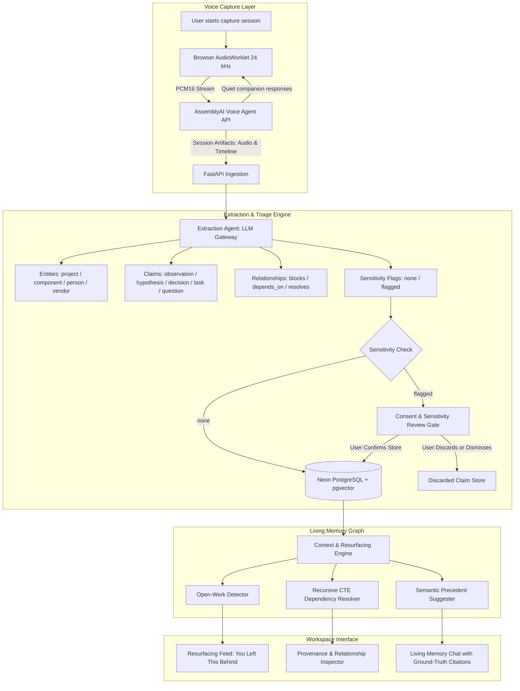
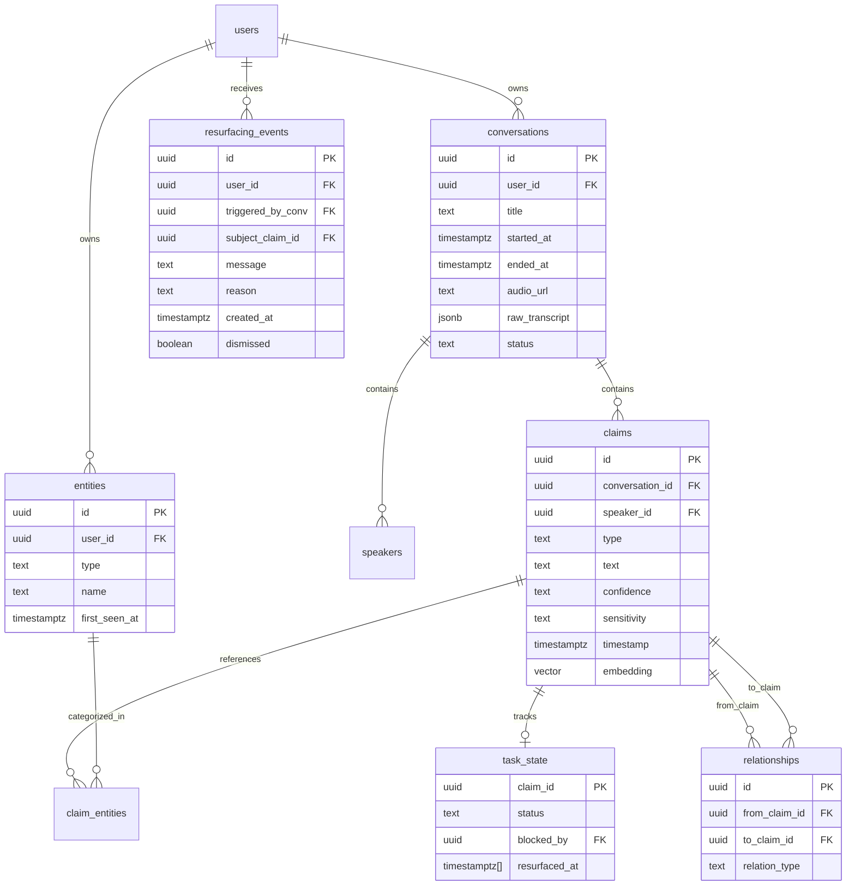
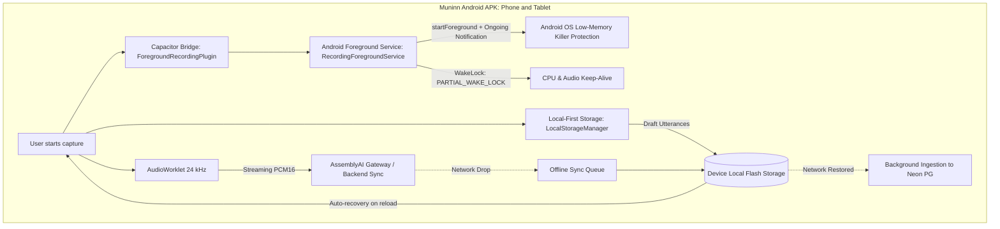

# Muninn

A living memory for your work: captures conversations you choose, connects the decisions, problems, tasks, and people inside them, and tells you what is still unfinished and why.

---

## 1. System Philosophy

1. **Capture is opt-in, per session**: No ambient or always-on listening. The user initiates a Muninn session explicitly, like starting a voice memo.
2. **Triage happens inside the session**: Not everything said is equally durable, and some content is sensitive. Triage is a post-hoc filter on consented data:
   > *"You decide what gets heard. We decide what is worth remembering."*
3. **Core Loop**:
   ```
   TALK -> UNDERSTAND -> CONNECT -> REMEMBER -> NOTICE SOMETHING IMPORTANT -> TELL ME
   ```
4. **Verifiable Provenance**: Every stored claim retains its origin (source conversation, speaker, timestamp, and confidence status).

---

## 2. System Architecture



---

## 3. Data Model

The relational graph is persisted in Neon Serverless PostgreSQL with `pgvector` for semantic precedent matching and recursive common table expressions (CTEs) for multi-depth dependency chains.



---

## 4. The Agent Engine

Muninn divides responsibilities across four distinct agents:

1. **The Voice Agent (AssemblyAI)**:
   - Quiet listening companion with one-sentence replies.
   - Dynamic keyterm biasing loaded from the user's `entities` table to prevent specialized component jargon from mishearing.
2. **The Extraction Agent (LLM Gateway)**:
   - Converts timestamped, speaker-tagged transcripts into structured JSON claims.
   - Classifies claim types (`observation`, `hypothesis`, `decision`, `task`, `question`) and direct non-hallucinated relationships.
3. **The Resurfacing Agent ("You Left This Behind")**:
   - Compares entities in the active session against candidate open tasks and questions.
   - Fires notes when a blocked task is unblocked, a question is reopened, or decisions conflict.
4. **The Precedent Suggester & Memory Chat**:
   - Queries historical claims with verified provenance citations `[Citation: <uuid>]`.

---

## 5. Getting Started

### Prerequisites
- Python 3.10+
- Node.js 18+
- Neon PostgreSQL connection string (configured with `pgvector`)
- AssemblyAI API Key

### Backend Setup
```bash
cd backend
python -m venv venv
# On Windows:
.\venv\Scripts\activate
# On Linux/macOS:
source venv/bin/activate

pip install -r requirements.txt
cp .env.example .env
# Fill in your ASSEMBLYAI_API_KEY and DATABASE_URL in .env

# Run FastAPI backend
python -m uvicorn app.main:app --host 0.0.0.0 --port 8000 --reload
```

### Frontend Setup
```bash
cd frontend
npm install
npm run dev
```

Visit `http://localhost:3000` to access the Muninn Studio.

---

## 6. Privacy & Consent Architecture

- Every captured session requires explicit user initiation.
- Statements that reference financial data, third parties, or off-the-record discussions receive a `sensitivity: flagged` tag.
- Flagged claims enter the **Sensitivity Review Gate**. The default on dismissal is **discard**, ensuring no sensitive data is indexed without informed consent.

---

## 7. Mobile & Tablet Android APK Architecture

To eliminate the session expiration and tab-discard issues common to mobile web browsers under memory pressure, Muninn includes a dedicated Android APK build with a native Foreground Audio Service and local-first storage engine.



### Key Advantages over Mobile Web:
1. **Low-Memory Killer (LMK) Resilience**: `RecordingForegroundService` binds with `FOREGROUND_SERVICE_TYPE_MICROPHONE` and an ongoing persistent notification, preventing the Android operating system from killing the audio pipeline when RAM runs low.
2. **Local-First Draft Durability**: All turns and transcripts write to local flash storage immediately as spoken, allowing seamless instant recovery even if the app process restarts.
3. **Offline Buffering**: When internet drops or bandwidth fluctuates, completed sessions and claim drafts queue locally on the device and sync to FastAPI and Neon PostgreSQL upon reconnection.

### Android Build & Emulation:
```bash
# Sync web export to native Android project
cd frontend
npm run build
npx cap sync

# Assemble Debug APK using Gradle
cd android
./gradlew assembleDebug

# Run on Android Emulator (e.g., MuninnTablet)
android run --device=emulator-5554
```

