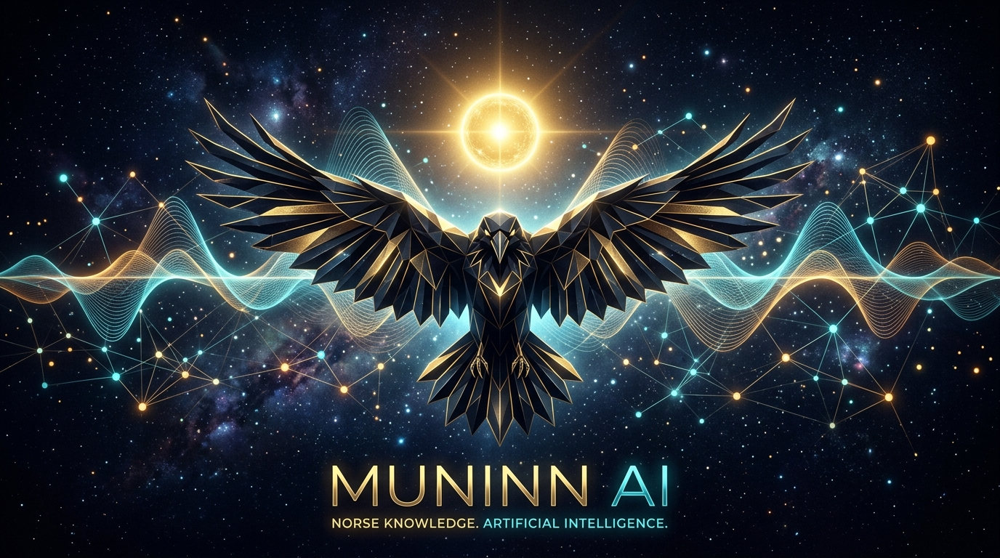
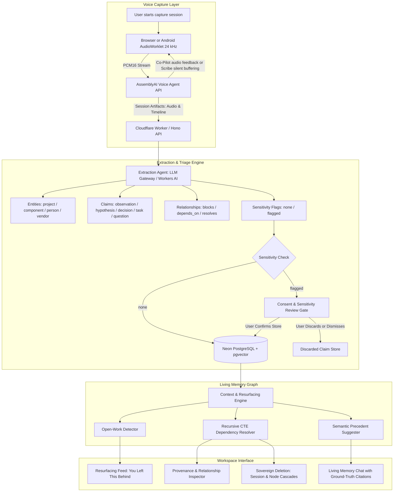
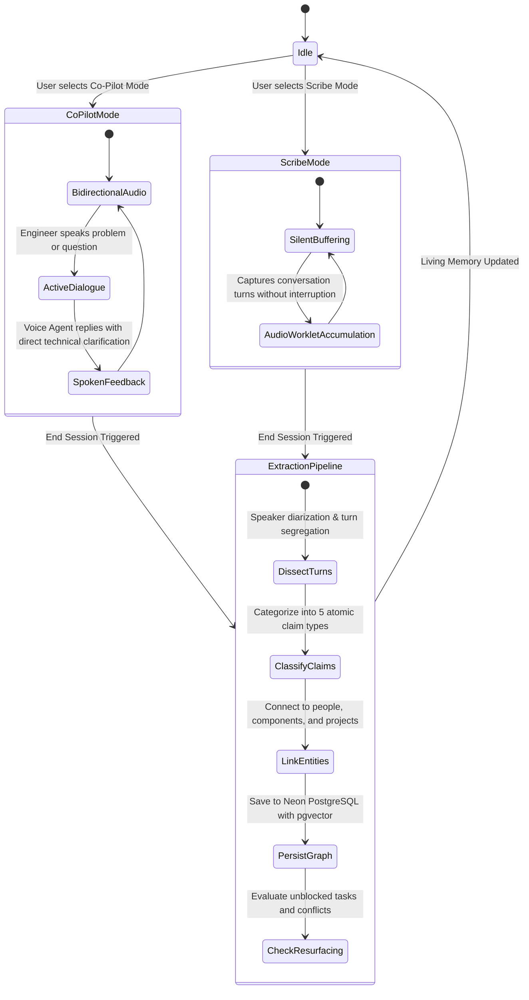
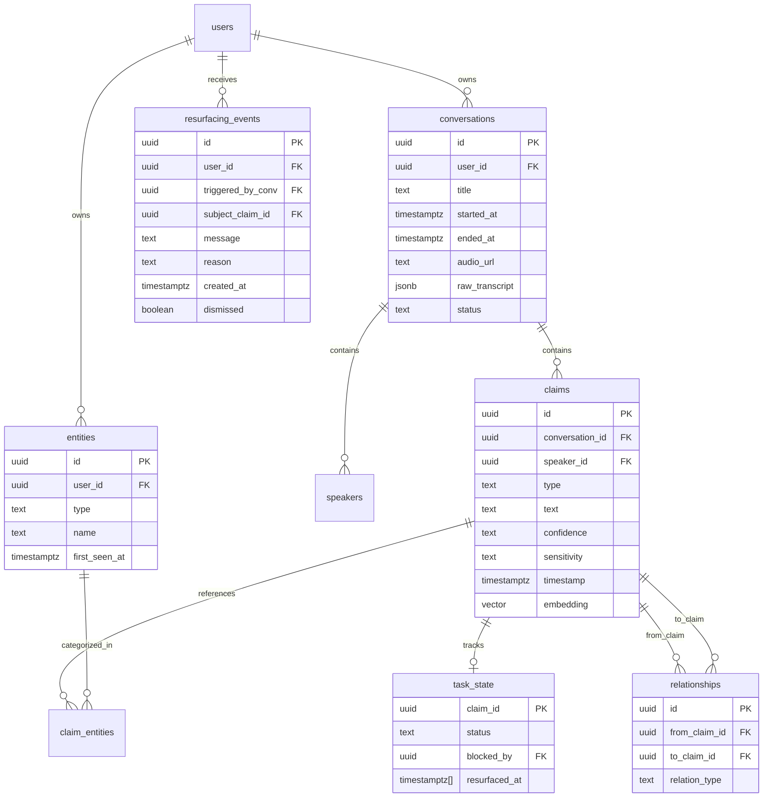
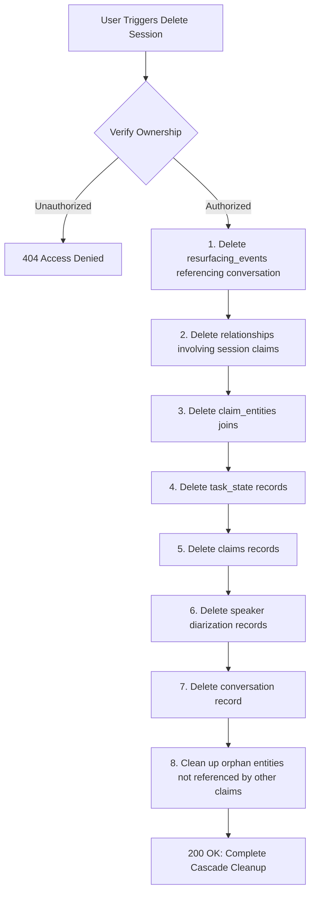
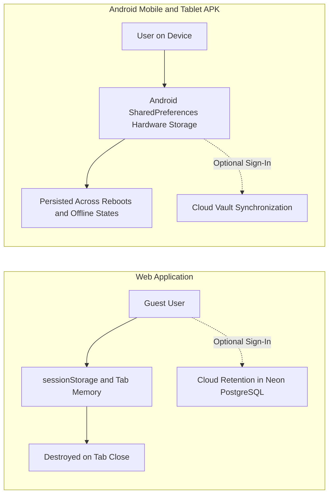
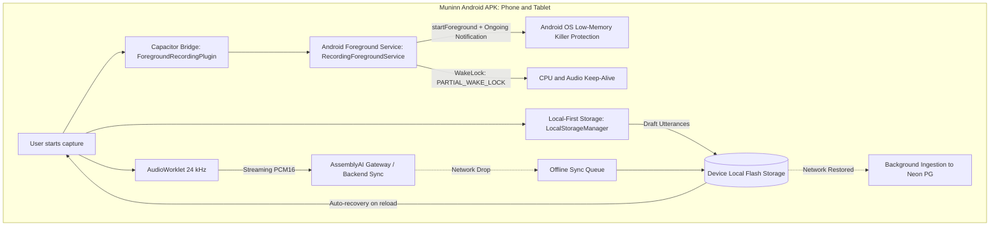

<p align="center">
  
</p>

# Muninn

> **A living memory for your work**: captures conversations you choose, connects the decisions, problems, tasks, and people inside them, and tells you what is still unfinished and why.

[](LICENSE)
[](https://muninn-nmk.pages.dev)
[](https://muninn-api.kshitiz23kumar.workers.dev/api/health)
[](https://docs.google.com/presentation/d/1BJt_kQttHV79CScvn4gGHwbHylm2Beor8tE13aguJwA/edit)
[](https://workers.cloudflare.com)
[](https://nextjs.org)
[](https://github.com/Erebuzzz/Muninn/releases)
[](https://www.assemblyai.com)

---

### About Muninn
Muninn is inspired by one of Odin's two sacred raven messengers from Norse mythology, whose name translates from Old Norse to *"memory"* or *"mind"*. It serves as an active cognitive companion that captures technical engineering discussions (via real-time 24kHz AudioWorklet stream or 1-tap quick voice memos), isolates verifiable ground-truth claims with turn-by-turn timestamps, weaves a recursive relational knowledge graph, and proactively resurfaces unfinished work, unblocked tasks, and conflicting decisions.

- **Live Production Application**: [https://muninn-nmk.pages.dev](https://muninn-nmk.pages.dev)
- **Cloudflare Global Edge API**: [https://muninn-api.kshitiz23kumar.workers.dev](https://muninn-api.kshitiz23kumar.workers.dev)
- **Interactive Documentation Codex**: [https://muninn-nmk.pages.dev/docs](https://muninn-nmk.pages.dev/docs)
- **Slide Presentation (Pitch Deck)**: [Google Slides Pitch Deck](https://docs.google.com/presentation/d/1BJt_kQttHV79CScvn4gGHwbHylm2Beor8tE13aguJwA/edit)
- **Android Mobile & Tablet APK**: [Muninn GitHub Releases](https://github.com/Erebuzzz/Muninn/releases)
- **Web Storage**: Ephemeral guest sandbox in session storage; persistent cloud retention upon optional sign-in.
- **Mobile Storage**: Local-first hardware persistence via Android SharedPreferences; zero mandatory cloud account.
- **Repository Topics**: `memory-system`, `audio-transcription`, `assemblyai`, `hono`, `nextjs15`, `cloudflare-workers`, `android`, `local-first`, `proactive-resurfacing`, `ai-companion`, `knowledge-graph`
- **Security Policy**: [SECURITY.md](SECURITY.md)
- **Privacy Policy**: [PRIVACY.md](PRIVACY.md)
- **License**: [MIT License](LICENSE)

---

## 1. System Philosophy

1. **Capture is opt-in, per session**: No ambient or always-on listening. The user initiates a Muninn session explicitly, like starting a voice memo or architecture huddle.
2. **Triage happens inside the session**: Not everything said is equally durable, and some content is sensitive. Triage is a post-hoc filter on consented data:
   > *"You decide what gets heard. We decide what is worth remembering."*
3. **Core Cognitive Loop**:
   ```
   TALK -> UNDERSTAND -> CONNECT -> REMEMBER -> NOTICE SOMETHING IMPORTANT -> TELL ME
   ```
4. **Verifiable Provenance**: Every stored claim retains its origin (source conversation, speaker, turn timestamp, and confidence status).
5. **Zero Cold-Start Edge Execution**: The primary backend runs on Cloudflare Workers with Hono and Neon Serverless PostgreSQL (`@neondatabase/serverless`), guaranteeing sub-millisecond response times without container spin-down delays.

---

## 2. System Architecture



---

## 3. Dual-Mode Voice Agent Architecture

Muninn offers two distinct runtime modes to fit different engineering contexts:



### Mode Comparison

| Feature | Co-Pilot Mode | Scribe Mode |
|---|---|---|
| **Intended Context** | Architecture whiteboarding, 1-on-1 problem solving, design reviews | Team standups, multi-speaker meetings, long discussions |
| **Agent Behavior** | Active verbal collaborator with concise spoken replies | Completely silent background listener |
| **Audio Pipeline** | Bidirectional 24kHz PCM stream via AssemblyAI WebSocket | Unidirectional 24kHz stream buffering via AudioWorklet |
| **Interruption Handling** | Native voice activity detection (VAD) | Passive buffering without interruption |
| **Memory Output** | Turn-by-turn timestamps, structured claims, graph edges | Turn-by-turn timestamps, structured claims, graph edges |

---

## 4. Data Model

The relational graph is persisted in Neon Serverless PostgreSQL with `pgvector` for semantic precedent matching and recursive common table expressions (CTEs) for multi-depth dependency chains.



---

## 5. Sovereign Memory Deletion & Cascade Architecture

You retain complete sovereignty over your cognitive vault. Deletion operations execute transactional cascading cleanups:



---

## 6. The Four Agent Subsystems

1. **The Voice Agent (AssemblyAI)**:
   - Real-time 24kHz PCM16 bidirectional streaming via `wss://agents.assemblyai.com/v1/ws`.
   - Dual personality routing: active Co-Pilot vs unobtrusive Scribe.
   - Dynamic keyterm biasing loaded from the user's `entities` table to prevent specialized component jargon from mishearing.
2. **The Extraction Agent (LLM Gateway / Workers AI)**:
   - Converts timestamped, speaker-tagged transcripts into structured JSON claims.
   - Classifies claims into five atomic types (`observation`, `hypothesis`, `decision`, `task`, `question`) and maps direct non-hallucinated relationships (`blocks`, `depends_on`, `resolves`).
3. **The Resurfacing Agent ("You Left This Behind")**:
   - Compares entities in the active session against candidate open tasks and questions.
   - Fires ambient notes when a newly discussed change unblocks a stale task from weeks ago or conflicts with a prior decision.
4. **The Precedent Suggester & Living Memory Chat**:
   - Queries historical claims with verified provenance citations `[Citation: <uuid>]` that link back to the exact turn and timestamp.

---

## 7. Dual Storage Privacy Models



### Web Ephemeral Sandbox (Guest Mode)
- Sign-in and sign-up are completely optional.
- Unauthenticated web sessions run as one-time sandboxes. Extracted claims and graphs exist strictly in your browser tab memory (`sessionStorage`) and are cleared when the tab closes.
- Registering or signing in is only required if you choose to permanently retain and synchronize your memory graph across devices in the cloud.

### Mobile & Tablet Android APK (Local-First Storage)
- Sign-in is 100% optional on native Android hardware.
- Captured sessions, claims, and graphs are saved directly to local flash storage on your mobile or tablet device (`@capacitor/preferences` / Android `SharedPreferences`).
- Data is retained locally across app restarts, system reboots, and offline states without requiring any cloud account.
- If you subsequently choose to sign in, your local records can synchronize back to your personal cloud vault.

### Privacy Review Gate
- Utterances marked as sensitive (financial terms, confidential personnel discussions, off-the-record comments) are sequestered in the Privacy Review Gate.
- Under the **Default-Discard** policy, flagged items are discarded unless explicitly confirmed by the user.

---

## 8. Mobile & Tablet Android APK Architecture

To eliminate the session expiration and tab-discard issues common to mobile web browsers under memory pressure, Muninn includes a dedicated Android APK build with a native Foreground Audio Service and local-first storage engine.



### Key Advantages over Mobile Web:
1. **Low-Memory Killer (LMK) Resilience**: `RecordingForegroundService` binds with `FOREGROUND_SERVICE_TYPE_MICROPHONE` and an ongoing persistent notification, preventing the Android operating system from killing the audio pipeline when RAM runs low.
2. **Local-First Draft Durability**: All turns and transcripts write to local flash storage immediately as spoken, allowing seamless instant recovery even if the app process restarts.
3. **Offline Buffering**: When internet drops or bandwidth fluctuates, completed sessions and claim drafts queue locally on the device and sync to the backend upon reconnection.

---

## 9. Getting Started

### Prerequisites
- Node.js 18+ (tested on Node v20/v26)
- Wrangler CLI 4+ (`npm install -g wrangler` or via `npx wrangler`)
- Neon PostgreSQL connection string (configured with `pgvector`)
- AssemblyAI API Key

### Primary Backend Setup: Cloudflare Workers (TypeScript + Hono)
```bash
cd worker
npm install

# Copy example dev variables
cp .dev.vars.example .dev.vars
# Add your DATABASE_URL and ASSEMBLYAI_API_KEY in .dev.vars

# Run locally on port 8000
npm run dev

# Deploy to Cloudflare Workers global network
npm run deploy
```

### Frontend Setup (Next.js 15)
```bash
cd frontend
npm install
npm run dev
```

Visit `http://localhost:3000` to access the Muninn Studio.

### Android Build & Emulation
```bash
# Sync web export to native Android project
cd frontend
npm run build
npx cap sync

# Assemble Debug APK using Gradle
cd android
./gradlew assembleDebug

# Run on Android Emulator (e.g., MuninnTablet)
android run --device=emulator-5554
```

---

## 10. Developer Details

- **Author**: Kshitiz Kumar
- **GitHub**: [github.com/Erebuzzz](https://github.com/Erebuzzz)
- **Contact Email**: [kshitiz23kumar@gmail.com](mailto:kshitiz23kumar@gmail.com)
