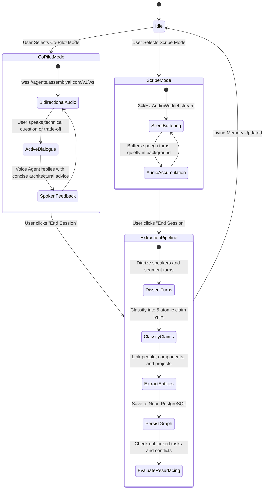

# Dual-Mode Voice Agent

Muninn supports two distinct speech operating modes tailored to different engineering scenarios: **Co-Pilot Mode** and **Scribe Mode**.

---

## Operating Mode State Machine

---

## Mode Comparison Matrix

| Property | Co-Pilot Mode | Scribe Mode |
|---|---|---|
| **Primary Use Case** | Architecture whiteboarding, 1-on-1 pairing, incident reviews | Team standups, multi-speaker meetings, sprint planning |
| **Agent Personality** | Active technical collaborator with one-sentence spoken replies | Completely silent background listener |
| **Audio Protocol** | Bidirectional 24kHz PCM stream via AssemblyAI WebSocket | Unidirectional 24kHz PCM stream buffered via AudioWorklet |
| **Voice Activity Detection** | Server-side VAD with interruptible speech synthesis | Client-side chunking without interruption |
| **System Prompt Focus** | Clarifies ambiguities, flags edge cases, confirms decisions | Captures ground truth without injecting agent opinions |
| **Post-Session Output** | Full structured claim extraction with turn timestamps | Full structured claim extraction with turn timestamps |

---

## WebSocket Session Lifecycle

1. **Token Vending**: The client calls `GET /api/sessions/token?mode=copilot` (or `mode=scribe`).
2. **WebSocket Handshake**: The client connects to `wss://agents.assemblyai.com/v1/ws` with the temporary JWT.
3. **24kHz Streaming**: AudioWorklet downsamples microphone input to 24,000 Hz, 1-channel, 16-bit PCM and streams binary frames over the socket.
4. **Session Termination**: When the user clicks *End Session*, the client sends an end-of-stream signal, retrieves session artifacts (audio URL and turn timeline), and sends them to `POST /api/sessions/:id/complete` for extraction.
