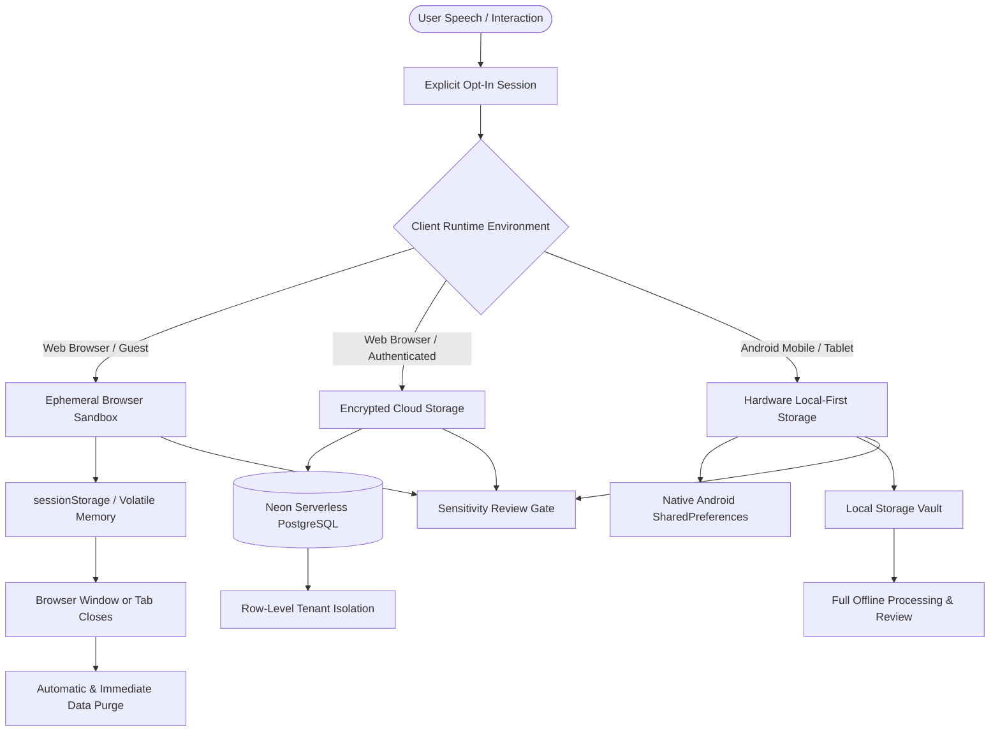
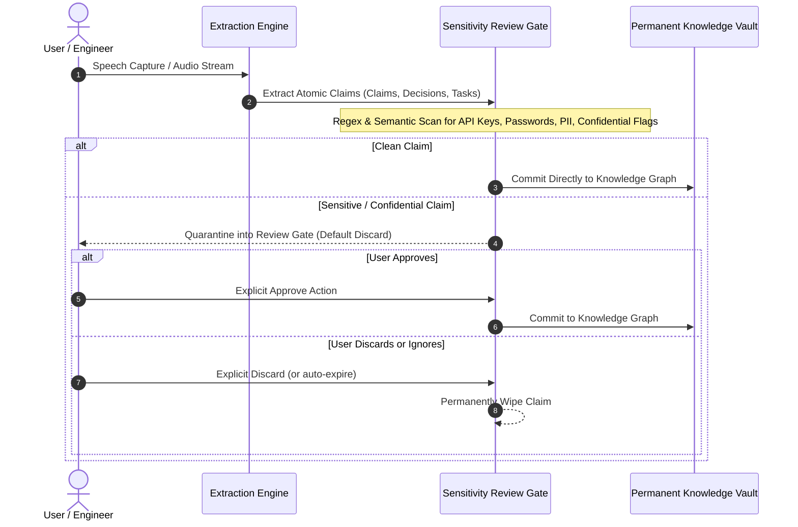

# Dual Storage Architecture & Privacy Standard

Muninn is engineered around a core privacy principle:
> *"You decide what gets heard. We decide what is worth remembering."*

Unlike passive surveillance tools or ambient meeting bots, Muninn never listens continuously in the background. Audio capture is opt-in, per session, with strict data boundaries between browser sandboxes and hardware storage.

---

## Storage Architecture Overview

Muninn separates runtime storage boundaries based on execution environment:

---

## 1. Web Browser Guest Mode (Ephemeral Sandbox)

When accessed without authentication at [muninn-nmk.pages.dev](https://muninn-nmk.pages.dev):

- **Zero Server Retention**: Audio chunks, live transcripts, and extracted graph nodes remain in `sessionStorage` and volatile JavaScript heap memory.
- **Tab Lifecycle Coupling**: Closing the browser tab or reloading immediately destroys session state. No local tracking cookies or persistent identifiers are deposited.
- **Opt-In Cloud Sync**: Connecting a Google or GitHub account enables syncing to Neon Serverless PostgreSQL over TLS 1.3 with AES-256 encryption at rest.

---

## 2. Android Hardware Local-First Mode

When installed via the [Android Tablet APK](https://github.com/Erebuzzz/Muninn/releases):

- **No Compulsory Login**: The tablet client functions autonomously without creating an account or supplying credentials.
- **Hardware-Backed Storage**: Session records, synthesized claims, and graph relationships persist directly in local device storage via Android `SharedPreferences`.
- **Zero Network Reliance**: The knowledge graph and review queue can be viewed and organized entirely offline.
- **Persistent Notification Guard**: Android displays an immutable foreground service notification with a bright visual badge during active capture, preventing background eavesdropping.

---

## 3. Sensitivity & Privacy Review Gate

All extracted atomic claims pass through an automated privacy and security filter before permanent graph inclusion:

### Quarantined Categories

1. **API Keys and Credentials**: High-entropy strings, AWS tokens, database connection strings, bearer tokens.
2. **Personal Identifiable Information (PII)**: Social security identifiers, personal addresses, credit card numbers.
3. **Privileged Business Metadata**: Unannounced acquisition discussions, executive compensation figures.
4. **Off-The-Record Directives**: Spoken phrases such as *"keep this off the record"* or *"do not write this down"*.

### Default-Discard Guarantee

Quarantined claims are held in a pending review state. If you do not explicitly approve a quarantined claim, it is **never** indexed into the knowledge graph, never embedded for vector search, and never resurfaced in copilot queries.

---

## 4. Deletion Mechanics & Cascade Purge

Users maintain absolute data sovereignty. When a session is deleted via `DELETE /api/sessions/:id`:

1. All associated claims in `claims` are dropped.
2. Inter-claim relationships in `claim_relations` are cascaded.
3. Graph links and references in `resurfacing_alerts` are cleaned.
4. Any active copilot thread referencing only this session is dissociated.

On Android, clearing application data from system settings immediately returns the device to a pristine, zero-data state.
