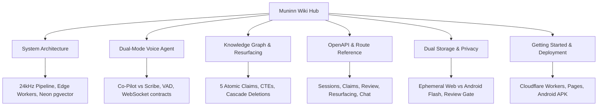

# Welcome to the Muninn Wiki

**Muninn** is an opt-in living memory system for engineering teams. It captures technical discussions (via real-time 24kHz AudioWorklet stream or 1-tap quick notes), isolates verifiable ground-truth claims with turn timestamps, weaves a relational knowledge graph, and proactively resurfaces unfinished work, unblocked tasks, and conflicting decisions.

---

## Quick Navigation



---

## Core Philosophy

1. **Capture is opt-in, per session**: No ambient or always-on listening. The user initiates a Muninn session explicitly, like starting a voice memo or architecture huddle.
2. **Triage happens inside the session**: Not everything said is equally durable, and some content is sensitive. Triage is a post-hoc filter on consented data:
   > *"You decide what gets heard. We decide what is worth remembering."*
3. **Core Cognitive Loop**:
   ```
   TALK -> UNDERSTAND -> CONNECT -> REMEMBER -> NOTICE SOMETHING IMPORTANT -> TELL ME
   ```
4. **Verifiable Provenance**: Every stored claim retains its origin (source conversation, speaker, turn timestamp, and confidence status).
5. **Zero Cold-Start Edge Execution**: The primary backend runs on Cloudflare Workers with Hono and Neon Serverless PostgreSQL (`@neondatabase/serverless`), guaranteeing sub-millisecond response times without container spin-down delays.

---

## Live Deployments & Key Links

- **Production Web Application**: [https://muninn-nmk.pages.dev](https://muninn-nmk.pages.dev)
- **Global Edge API**: [https://muninn-api.kshitiz23kumar.workers.dev](https://muninn-api.kshitiz23kumar.workers.dev)
- **Interactive Documentation Codex**: [https://muninn-nmk.pages.dev/docs](https://muninn-nmk.pages.dev/docs)
- **Slide Presentation (Pitch Deck)**: [Google Slides Pitch Deck](https://docs.google.com/presentation/d/1BJt_kQttHV79CScvn4gGHwbHylm2Beor8tE13aguJwA/edit)
- **Android Mobile & Tablet APK**: [GitHub Releases v1.5](https://github.com/Erebuzzz/Muninn/releases)
- **Public Repository**: [https://github.com/Erebuzzz/Muninn](https://github.com/Erebuzzz/Muninn)
