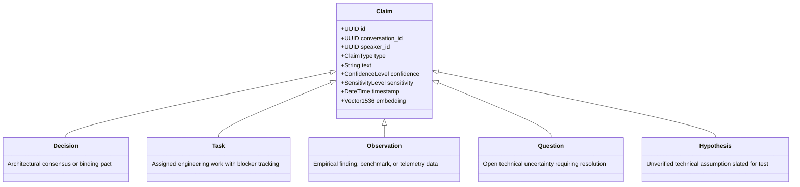
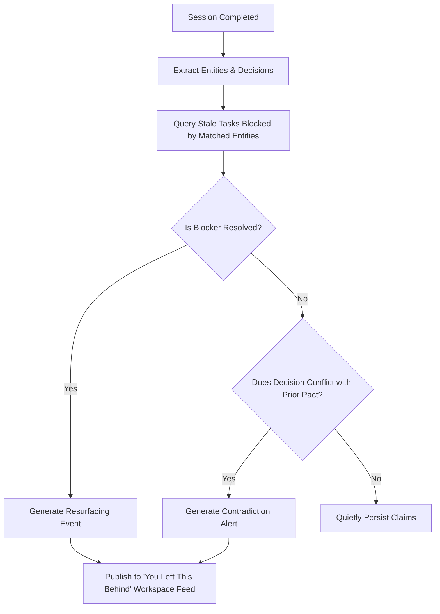
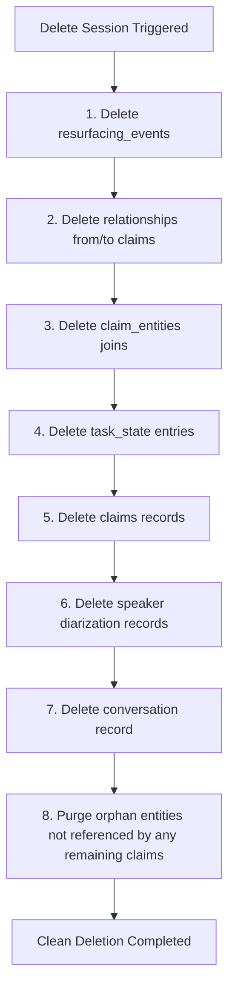

# Knowledge Graph & Proactive Resurfacing

Muninn transforms unstructured spoken audio into a living, typed relational graph.

---

## 1. The Five Atomic Claim Types

Every technical sentence is triaged into one of five atomic claim types:



---

## 2. Recursive Dependency Traversals (CTEs)

Muninn models relationships between claims using directional edges (`blocks`, `depends_on`, `resolves`). Multi-tier dependency trees are resolved using recursive Common Table Expressions:

```sql
WITH RECURSIVE dependency_chain AS (
  SELECT 
    c.id, c.text, c.type, ts.status, ts.blocked_by, 1 AS depth
  FROM claims c
  LEFT JOIN task_state ts ON ts.claim_id = c.id
  WHERE c.id = $1::uuid

  UNION ALL

  SELECT 
    parent.id, parent.text, parent.type, pts.status, pts.blocked_by, dc.depth + 1
  FROM claims parent
  JOIN relationships r ON r.from_claim_id = parent.id
  LEFT JOIN task_state pts ON pts.claim_id = parent.id
  JOIN dependency_chain dc ON dc.blocked_by = parent.id
  WHERE dc.depth < 10
)
SELECT * FROM dependency_chain;
```

---

## 3. Proactive Resurfacing Engine ("You Left This Behind")

When a session completes, Muninn inspects all newly resolved entities and decisions against the user's active graph:



---

## 4. Sovereign Memory Deletion & Cascade Cleanups

Users retain total ownership over their memory. Deletion of sessions or claims cascades cleanly across all referencing tables:


