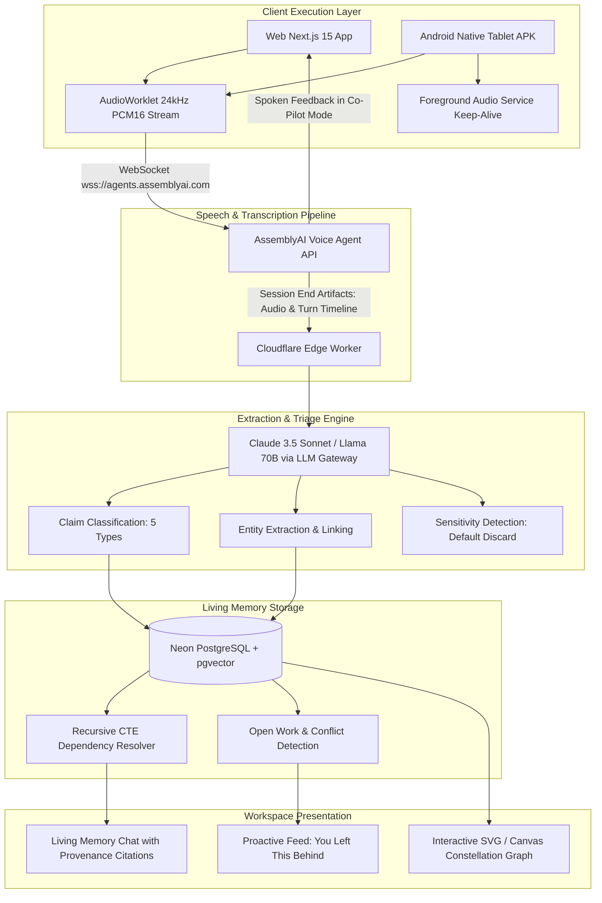
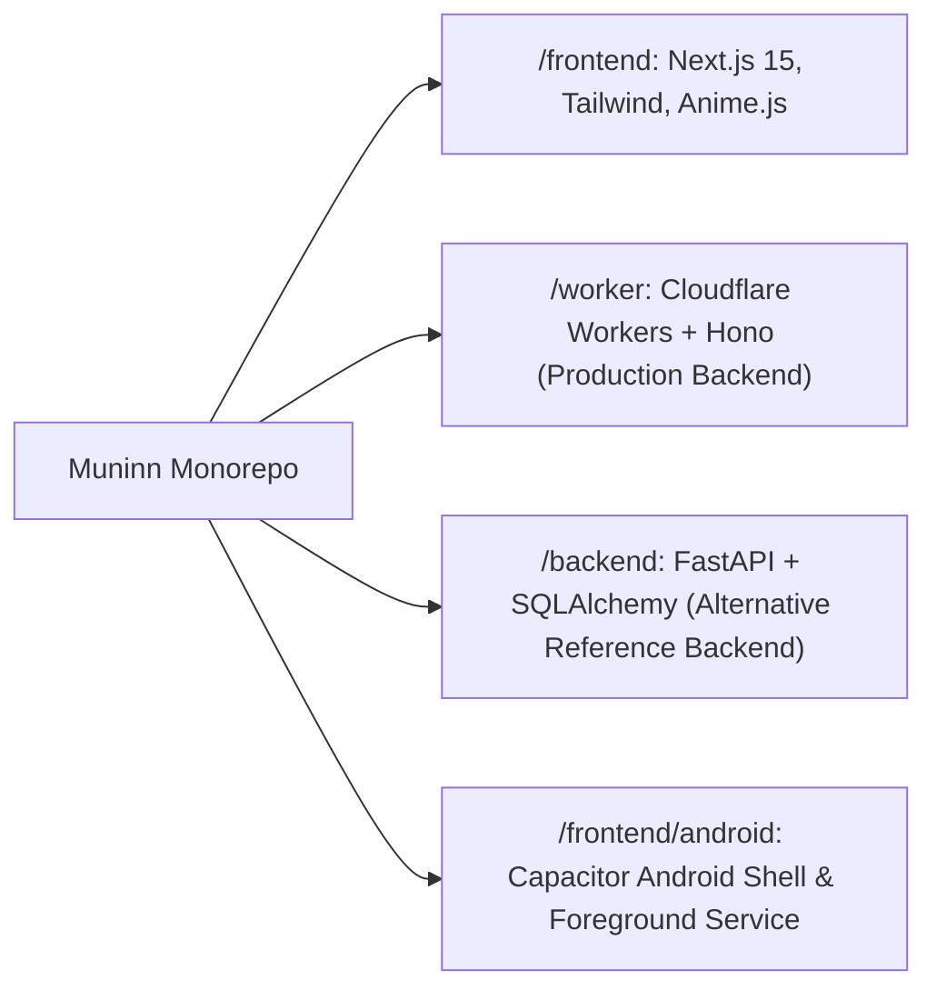

# System Architecture

Muninn is engineered as a high-performance edge cognitive layer that connects real-time acoustic speech to structured relational memory.

---

## Architectural Overview

---

## The Monorepo Component Breakdown

### 1. `/worker` (Primary Production Runtime)
- **Framework**: Hono running on Cloudflare Workers edge nodes worldwide.
- **Database Driver**: `@neondatabase/serverless` using zero cold-start HTTP connection pooling.
- **Authentication**: Web Crypto PBKDF2 (100,000 iterations) with Hono JWT (HS256).
- **Latency**: Sub-15 millisecond execution time from global edge points.

### 2. `/frontend` (Mythic Interface Shell)
- **Framework**: Next.js 15 with React 19.
- **Theming**: Celestial dual-mode system (Nyx obsidian/violet vs Helios amber/gold).
- **Acoustic Worklet**: `public/pcm-processor.js` capturing 24kHz mono PCM16 audio chunks.
- **Animation**: Anime.js physics powering celestial orb transitions, runic compass rotations, and faceted svg strokes.

### 3. `/frontend/android` (Local-First Android APK)
- **Engine**: Capacitor with bespoke native plugin `ForegroundRecordingPlugin`.
- **Audio Durability**: `RecordingForegroundService` with `FOREGROUND_SERVICE_TYPE_MICROPHONE` and an ongoing persistent notification to defeat the Android Low-Memory Killer (LMK).
- **Storage**: Native `SharedPreferences` for 100% on-device offline persistence.
